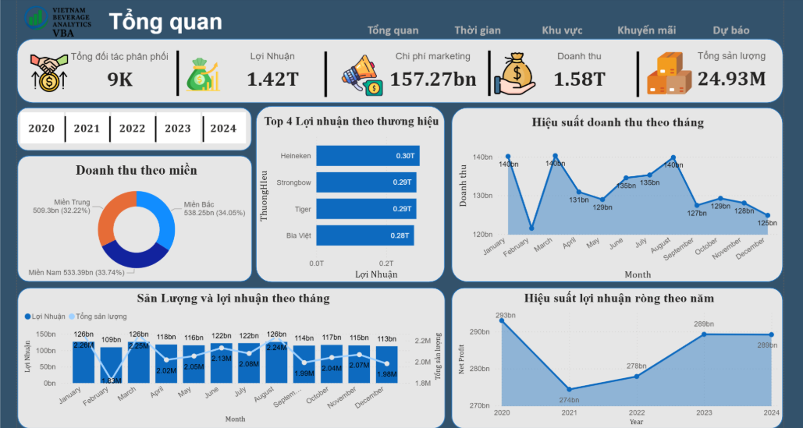
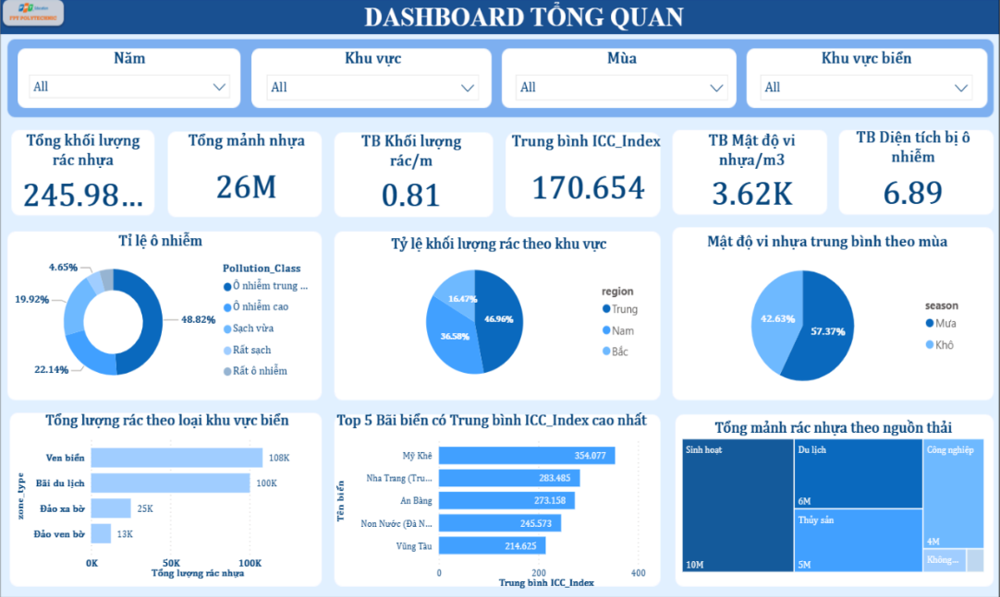

# Xin chào! Tôi là Nguyễn Thị Thùy Trâm

# Data Analyst Intern | Data Analysis 

## Giới thiệu bản thân

Tôi có niềm đam mê với máy tính và công nghệ từ nhỏ. Trong quá trình học THPT, tôi theo học song song chương trình văn hóa và công nghệ thông tin, từ đó hình thành nền tảng về tư duy logic và kỹ năng công nghệ. Hiện tại tôi là sinh viên đang theo học ngành Xử lý dữ liệu và Phân tích dữ liệu tại Cao đẳng FPT Polytechnic. Tôi quan tâm đến việc khai thác dữ liệu, phân tích thông tin và xây dựng các hệ thống trực quan hóa dữ liệu nhằm hỗ trợ doanh nghiệp đưa ra quyết định dựa trên dữ liệu.

Trong quá trình học tập và thực hành, tôi đã sử dụng các công cụ như Excel, SQL, Python, Power BI và Tableau để làm sạch dữ liệu, phân tích dữ liệu và xây dựng dashboard trực quan.

Tôi cũng có kiến thức nền tảng về Data Warehouse và mô hình dữ liệu phục vụ cho việc lưu trữ và phân tích dữ liệu.

Mục tiêu của tôi là trở thành Data Analyst chuyên nghiệp có khả năng khai thác dữ liệu và cung cấp insight có giá trị cho doanh nghiệp.

# Thông tin cá nhân

Họ và tên: Nguyễn Thị Thùy Trâm

Ngày sinh: 27/09/2006

Địa chỉ: Sơn Đồng, Hà Nội, Việt Nam

Số điện thoại: 0981954506

Email: [thuytram279206@gmail.com](mailto:thuytram279206@gmail.com)

# Học vấn

**Cao đẳng Bách Khoa**
: Ngành Ứng dụng phần mềm
2021 – 2023

**Cao đẳng FPT Polytechnic**
: Ngành Xử lý dữ liệu
2024 – 2026

# Kỹ năng

### Phân tích dữ liệu

* Excel (Data Cleaning, PivotTable, Data Analysis)
* SQL (Query, Join, GROUP BY, Aggregation)
* Python (Pandas, Data Processing)
* Exploratory Data Analysis (EDA)

### Trực quan hóa dữ liệu

* Power BI (Dashboard, Data Modeling, DAX, Power Query)
* Excel Charts
* Tableau

### Quản lý dữ liệu

* Data Warehouse cơ bản
* Thiết kế mô hình dữ liệu
* Hiểu biết về ETL và xử lý dữ liệu

### Kỹ năng mềm

* Tư duy phân tích
* Làm việc nhóm
* Quản lý thời gian
* Giải quyết vấn đề

# Công cụ và công nghệ

Tableau | Python | Pandas | SQL | Excel | Power BI | Power Query | Data Warehouse

# Dự án phân tích dữ liệu

## PHÂN TÍCH DỮ LIỆU KINH DOANH HIỆU QUẢ BÁN HÀNG CỦA BIA VIỆT NAM

**Mục tiêu**
: Phân tích dữ liệu bán hàng của công ty kinh doanh bia nhằm xác định xu hướng doanh thu, hiệu quả sản phẩm và hiệu suất kinh doanh theo khu vực.

**Công cụ sử dụng**
Power BI | Excel | DAX

**Quy trình thực hiện**

* Làm sạch và chuẩn hóa dữ liệu bằng Excel
* Xây dựng mô hình dữ liệu trong Power BI
* Tạo các measure bằng DAX
* Thiết kế dashboard trực quan hóa dữ liệu

**Kết quả**

* Xác định khu vực có doanh thu cao nhất
* Phân tích xu hướng doanh thu theo thời gian
* Xác định sản phẩm mang lại lợi nhuận cao
* Đánh giá hiệu quả của từng kênh phân phối

🔗 [PHÂN TÍCH DỮ LIỆU KINH DOANH HIỆU QUẢ BÁN HÀNG CỦA BIA VIỆT NAM](https://docs.google.com/spreadsheets/d/1H7FPoKA_tZmVv0iapIVUAtU_LhROEL_XdWQb3POW5ME/edit?gid=0#gid=0)

### Dashboard

## PHÂN TÍCH RÁC THẢI NHỰA VÀ MẬT ĐỘ VI NHỰA ẢNH HƯỞNG ĐẾN MÔI TRƯỜNG BIỂN VIỆT NAM

**Mục tiêu**
Phân tích dữ liệu môi trường nhằm xác định mật độ rác thải nhựa tại các bãi biển Việt Nam.

**Công cụ sử dụng**
Tableau | Python | Pandas | Excel | Power BI

**Quy trình thực hiện**

* Thu thập và xử lý dữ liệu môi trường
* Làm sạch dữ liệu bằng Python và Pandas
* Phân tích dữ liệu để xác định xu hướng ô nhiễm
* Xây dựng dashboard trực quan hóa dữ liệu

**Kết quả**

* Xác định các khu vực có mật độ rác thải cao
* Phân tích xu hướng ô nhiễm theo thời gian
* Nhận diện các loại rác thải phổ biến
* Đề xuất giải pháp giảm thiểu ô nhiễm

🔗 [PHÂN TÍCH RÁC THẢI NHỰA VÀ MẬT ĐỘ VI NHỰA ẢNH HƯỞNG ĐẾN MÔI TRƯỜNG BIỂN VIỆT NAM](https://drive.google.com/drive/folders/1JUVtkE0aGuzA5RFisnm8qm3Lh2RSM2_B)

### Dashboard

# Mục tiêu nghề nghiệp

Data Analyst Intern với nền tảng vững về Excel, SQL, Power BI, Tableau và Python(Pandas). Có kinh nghiệm thực hiện các dự án phân tích dữ liệu, xây dựng dashboard và làm việc với dữ liệu trong môi trường Data Warehouse. Mong muốn áp dụng kỹ năng phân tích và trực quan hóa dữ liệu để hỗ trợ ra quyết định kinh doanh.
# Sở thích

* Nấu ăn
* Tập gym
* Chạy bộ
* Du lịch
* Tìm hiểu dữ liệu và công nghệ
* Tham gia các hoạt động cộng đồng

# Hoạt động
* Chạy Marathon Tam Chúc
* Hoạt động thiện nguyện tại làng trẻ Hữu Nghị
* Chạy vưỡng ngưỡng 15km
* Kinh doanh để ủng hộ xây trường cho trẻ em vùng cao

# Liên hệ

Email: [thuytram279206@gmail.com](mailto:thuytram279206@gmail.com)

Số điện thoại: 0981954506

Địa chỉ: Sơn Đồng, Hà Nội, Việt Nam
